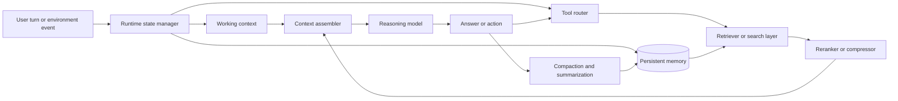
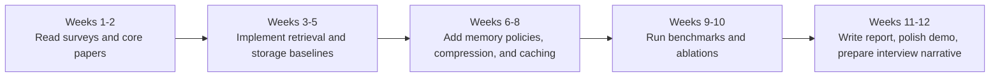

  - [Summary](#summary)
  - [What Context Engineering Means for Agents](#what-context-engineering-means-for-agents)
  - [Recent Research and Benchmarks](#recent-research-and-benchmarks)
  - [Industry and Open-Source Landscape](#industry-and-open-source-landscape)
  - [Technical Design Dimensions](#technical-design-dimensions)
  - [Implementation Patterns and Tooling](#implementation-patterns-and-tooling)
  - [Research Directions](#research-directions)
  - [Practical Roadmap and Risks](#practical-roadmap-and-risks)
- [Reference](#reference)

## Summary

“Context engineering” for agents is broader than prompt engineering. Prompt engineering optimizes the wording, structure, and demonstrations inside a prompt; context engineering optimizes the entire information payload and runtime that shape an agent’s behavior at inference time: conversation state, retrieval, memory, tool schemas, intermediate artifacts, summaries, caches, and multi-agent communication. Recent surveys now explicitly frame context engineering as a discipline that spans context retrieval/generation, processing, management, and system-level implementations such as RAG, memory systems, tool-integrated reasoning, and multi-agent systems. In parallel, agent-memory surveys argue that memory should be treated as a first-class systems primitive rather than a vague synonym for “long context.” ([1](#ref-1))

The last three years of research have converged on five high-confidence findings.

1. sheer context-window size is not enough: long-context models still exhibit position bias, “lost in the middle” effects ([2](#ref-2)), and steep performance decay as reasoning complexity rises.
2. external memory systems help, but naive vector-store retrieval is often too shallow for temporal, multi-hop, or action-conditioned tasks.
3. better results increasingly come from _structured_ memory—session decomposition, temporal indices, graph memory, reflection loops, and learned or agentic memory operations—rather than from simply “retrieve top-k chunks.”
4. tool-use itself has become a context problem: large tool catalogs, long tool responses, and multi-turn trajectories can degrade performance sharply.
5. benchmarks are moving from static recall toward _memory-in-action_ settings, where an agent must both remember and use memory to plan, act, and update state over time.

The “context engineering” problem should be treated as a systems-and-evaluation problem, not just a modeling problem. Focus on the design/implementations of a memory taxonomy, retrieval/indexing choices, context assembly and compression, state persistence ([3](#ref-3)), tool schemas, observability, cost/latency tradeoffs, and benchmark-driven evaluation.

| What matters most                 | Why it matters                                                                                                                                                                   |
| --------------------------------- | -------------------------------------------------------------------------------------------------------------------------------------------------------------------------------- |
| Benchmark before optimizing       | LoCoMo ([13](#ref-13)), LongMemEval ([29](#ref-29)), LongBench v2, BFCL([30](#ref-30)), ToolSandbox, LongFuncEval ([32](#ref-32)), and MemoryArena ([33](#ref-33)) measure different failure modes; optimizing one can miss the others. |
| Prefer structure over brute force | In 2024–2026, the most interesting gains come from graph memory ([6](#ref-6)), temporal retrieval, learned memory actions, reflection, and better assembly/compression.                    |

## What Context Engineering Means for Agents

A practical definition that matches the recent literature is: **context engineering is the systematic design, optimization, and governance of the information that an LLM receives and produces during inference**. That includes prompt content, retrieved evidence, session state, memory, tool definitions, tool outputs, routing decisions, caches, and compaction policies.

For agents, it helps to separate five concepts. 

- **Prompt engineering** is the craft of writing instructions, exemplars, role specifications, XML structure, or chain/pipeline prompts without changing model weights.
- **State** is the structured runtime object for an ongoing run or conversation: message history, partial plans, tool outputs, counters, and control flags.
- **Memory** is information persisted _beyond_ the immediate active context, so it can be recalled later across turns or sessions.
- **Tool use** is active externalization: the agent acquires new context or takes action by calling functions, APIs, search, code, browsers, or MCP servers.
- **Multi-agent context** adds partitioning and communication: who sees which context, what is shared versus private, and how messages or memory fragments are coordinated across agents.

Recent agent-memory work also sharpens the memory vocabulary. The 2025 survey argues that traditional “short-term vs long-term” labels are too coarse, and proposes thinking in terms of forms, functions, and dynamics, with functional categories such as **working memory**, **factual memory**, and **experiential memory**. ([4](#ref-4))

1. **Factual Memory**: The agent’s declarative knowledge base, established to ensure consistency, coherence, and adaptability by recalling explicit facts, user preferences, and environmental states. This system answers the question: _“What does the agent know?”_
2. **Experiential Memory**: The agent’s procedural and strategic knowledge, accumulated to enable continual learning and self-evolution by abstracting from past trajectories, failures, and successes. This system answers: _“How does the agent improve?”_
3. **Working Memory**: The agent’s capacity-limited, dynamically controlled scratchpad for active context management during a single task or session. This system answers: _“What is the agent thinking about now?”_

One of the clearest early blueprints for agent context handling is the retrieve–reflect–plan loop in _Generative Agents_ ([10](#ref-10)), which stores a stream of experiences, retrieves a relevant subset, synthesizes higher-level reflections, and uses them for planning. That paper, together with later systems such as Voyager ([11](#ref-11)), MemGPT, MemoryBank ([18](#ref-18)), and A-Mem ([21](#ref-21)), shifted the field from “fit more tokens” toward “decide what deserves to be in context.”

## Recent Research and Benchmarks

The last three years produced a coherent research arc. Early 2023 work established the architectural motif: _Generative Agents_ ([10](#ref-10)) formalized memory streams, reflection, and planning; _Voyager_ ([11](#ref-11)) showed lifelong skill accumulation and retrieval in an embodied setting; _Toolformer_ and related tool-use work pushed models toward self initiated API usage; and _Self-RAG_ ([17](#ref-17)) turned retrieval into an adaptive, on-demand process rather than a fixed pre-retrieval step. At the same time, _Lost in the Middle_ ([2](#ref-2)) and _LongBench_ ([26](#ref-26)) demonstrated that long context is not equivalent to robust long-context reasoning, especially when relevant evidence is buried or distributed.

In 2024–2025, the center of gravity shifted toward memory systems and benchmark realism. LoCoMo ([13](#ref-13)) and LongMemEval ([29](#ref-29)) moved evaluation from single long documents to long, multi-session interactions with temporal reasoning, updates, and abstention. HippoRAG introduced graph-and-PageRank-style associative retrieval; MemoRAG introduced global-memory-augmented retrieval ([6](#ref-6)); A-Mem organized memory as linked notes rather than flat chunks; Reflective Memory Management added prospective and retrospective reflection ([21](#ref-21)); and LongBench v2 raised difficulty toward deeper real-world reasoning. This period also saw aggressive work on compression and efficiency—LLMLingua ([24](#ref-24)), LongLLMLingua, Selective Context, and RetrievalAttention—because long context is expensive even when accuracy improves. 

In 2026, the research moves from “better recall” to **memory as policy** and **memory-in-action**. AgeMem learns memory operations as tool-like actions integrated into the agent policy ([14](#ref-14)); MemoryArena evaluates whether memory actually improves future multi-session decision making ([33](#ref-33)); ASTRA-bench stresses tool-based planning with messy personal context ([34](#ref-34)); M2CL and Epistemic Context Learning treat multi-agent discussion as a context-coherence and trust-estimation problem; and recent memory preprints such as MemMachine and decoupled retrieval frameworks emphasize preserving episodic ground truth and composing retrieval contexts rather than merely ranking chunks by similarity. Some of these 2026 works are still preprints, but they are strong indicators of current research direction. ([56](#ref-56))

| Theme                           | Representative papers and methods                                                                                                          | Why they matter                                                                      |
| ------------------------------- | ------------------------------------------------------------------------------------------------------------------------------------------ | ------------------------------------------------------------------------------------ |
| Memory streams and reflection   | _Generative Agents_ introduced observation → retrieval → reflection → planning. ([10](#ref-10))                                                       | Still the clearest conceptual template for agent memory loops.                       |
| Lifelong skill memory           | _Voyager_ stores executable skills and retrieves them in Minecraft. ([11](#ref-11))                                                                   | Shows that memory can be procedural, not just textual.                               |
| Adaptive retrieval              | _Self-RAG_ retrieves on demand and critiques its own generations with reflection tokens. ([17](#ref-17))                                              | Important for deciding _when_ extra context is necessary.                            |
| Human-like long-term memory     | _MemoryBank_ stores, recalls, updates memories and user portraits. ([18](#ref-18))                                                                    | Good reference point for personalization-oriented memory.                            |
| Graph/associative retrieval     | _HippoRAG_ combines LLMs, knowledge graphs, and Personalized PageRank; _HippoRAG 2_ extends this toward continual non-parametric learning. | Strong for multi-hop and associative recall, where plain vector top-k often fails.   |
| Global-memory RAG               | _MemoRAG_ uses a long-range “global memory” model to guide retrieval. ([20](#ref-20))                                                                 | Useful when tasks need holistic understanding of a corpus before pinpoint retrieval. |
| Agentic memory organization     | _A-Mem_ dynamically links notes using Zettelkasten-like organization. ([21](#ref-21))                                                                 | Reframes memory from flat storage into evolving relational structure.                |
| Reflective memory update        | _Reflective Memory Management_ adds prospective summary and retrospective RL-style retrieval refinement. ([22](#ref-22))                              | Makes memory writing and retrieval adaptive rather than static.                      |
| Learned memory actions          | _AgeMem_ integrates store/retrieve/update/summarize/discard into the agent policy. ([14](#ref-14))                                                    | One of the clearest signs that memory control is becoming a learning problem.        |
| Efficient long-context handling | _LLMLingua_, _LongLLMLingua_, _Selective Context_, _RetrievalAttention_. ([24](#ref-24))                                                              | The engineering reality: context quality must be balanced against cost and latency.  |

| Benchmark                                 | What it measures                                                                         | Why you should know it                                                             |
| ----------------------------------------- | ---------------------------------------------------------------------------------------- | ---------------------------------------------------------------------------------- |
| _Lost in the Middle_ ([2](#ref-2))                  | Position bias in long contexts                                                           | Canonical evidence that longer windows do not imply equal access to all positions. |
| _LongBench_ and _LongBench v2_ ([26](#ref-26))       | Long-context QA, summarization, few-shot, code, and deeper reasoning                     | Good general-purpose long-context benchmark family.                                |
| _∞Bench_ and _BABILong_ ([27](#ref-27))              | Very-long-context and distributed-fact reasoning                                         | Stress tests for extreme lengths and reasoning under sparse evidence.              |
| _LoCoMo_ ([13](#ref-13))                             | Very long-term conversational memory, QA, summarization, multimodal dialogue             | Important for multi-session, interference-heavy conversational memory.             |
| _LongMemEval_ ([29](#ref-29))                        | Information extraction, multi-session reasoning, temporal reasoning, updates, abstention | One of the most useful memory benchmarks for assistant-style agents.               |
| _BFCL_ ([30](#ref-30))                               | Function-calling/tool-use accuracy, including AST and executable correctness             | Essential if your internship touches tool-heavy agents.                            |
| _τ-bench_ ([31](#ref-31)) and _ToolSandbox_ ([70](#ref-70))     | Stateful tool-agent-user interaction and on-policy conversational tool use               | Move evaluation past single static prompts.                                        |
| _LongFuncEval_ ([32](#ref-32))                       | Tool calling under long catalogs, long responses, and long dialogues                     | Directly relevant to context engineering for enterprise agents.                    |
| _MemoryArena_ and _MemoryAgentBench_ ([33](#ref-33)) | Memory-in-action, test-time learning, selective forgetting, interdependent tasks         | Important emerging benchmarks because they connect memory to action quality.       |
| _ASTRA-bench_ ([34](#ref-34))                        | Tool-use planning with personal user context                                             | Strong fit for personalized assistants and context-aware planning.                 |

The major open problems are remarkably stable across papers. Existing systems still struggle with temporal reasoning, knowledge updates, selecting the right granularity for memory writes, assembling non-redundant but sufficient evidence, robust tool use under long responses or large toolsets, and fair evaluation when memory quality and
acting quality are tightly coupled. Benchmarks are improving, but cross-benchmark transfer remains weak: systems that do well on static long-context recall can still perform poorly when memory must support future action. ([29](#ref-29))

## Industry and Open-Source Landscape

Industry practice has moved decisively toward explicit context/runtime features. OpenAI’s current platform exposes persistent conversation state, server-side compaction for long-running interactions, automatic prompt caching, tool search to avoid loading entire tool catalogs up front, and MCP/connectors for external services ([39](#ref-39)); Anthropic exposes prompt caching with automatic or explicit cache breakpoints and has publicly framed “effective context engineering” as the core mental model for agent quality ([40](#ref-40)); Google’s Gemini/Vertex stack similarly supports implicit and explicit context caching with resource IDs, expiration policies, and cost/latency benefits ([41](#ref-41)). The common pattern is clear: major vendors increasingly productize context management as a first-class API concern rather than leaving it entirely to application code.

Open-source frameworks differ mainly in how opinionated they are about state, memory, and orchestration. LangGraph emphasizes long-running, stateful workflows with low-level graph control ([37](#ref-37)); AutoGen popularized multi-agent conversation but is now in maintenance mode ([42](#ref-42)); Haystack offers modular pipelines with explicit control over retrieval, routing, memory, and generation ([43](#ref-43)); Semantic Kernel positions itself as enterprise middleware for agents and multi-agent systems ([44](#ref-44)); LlamaIndex is strongest as a data orchestration and retrieval layer ([45](#ref-45)); Letta is explicitly memory-first and treats certain memory blocks as always-in-context; CrewAI packages multi-agent orchestration with built-in memory abstractions ([38](#ref-38)).

The memory-layer market has also become more specialized. Letta productizes the MemGPT-style distinction between always-visible core memory and retrievable external memory. Mem0 positions itself as a universal, self-improving memory layer with scoped memory types and a production-focused paper claiming large token and latency savings relative to full-context baselines ([46](#ref-46)). Zep emphasizes “context engineering” and graph-based assembly of personalized context from chat history, documents, business data, and events, with low-latency retrieval ([35](#ref-35)). MemMachine is a newer open-source entrant that stresses preserving full conversational episodes rather than aggressively extracting lossy facts. ([56](#ref-56))

| Framework or product                               | Core abstraction                                   | Context and memory posture                                                     | Best use case                                                    |
| -------------------------------------------------- | -------------------------------------------------- | ------------------------------------------------------------------------------ | ---------------------------------------------------------------- |
| OpenAI Agents SDK / Responses / Conversations ([39](#ref-39)) | Agent runs over persistent conversations and tools | Strong platform-native state, compaction, caching, MCP, tool search            | Product teams building tool-heavy agents quickly                 |
| Anthropic Claude API ([40](#ref-40))                          | Prompting + tools + caching                        | Strong caching and context-design guidance; less opinionated OSS runtime       | Teams optimizing cost/latency in long multi-turn flows           |
| Vertex AI / Gemini context cache ([41](#ref-41))              | Explicit or implicit cached context objects        | Good cloud-native context reuse with TTLs and managed lifecycle                | Enterprise workloads already on Google Cloud                     |
| LangGraph ([37](#ref-37))                                     | Stateful graph runtime                             | Explicit control over long-running state and orchestration                     | Researchers and engineers who want control over execution graphs |
| Haystack ([43](#ref-43))                                      | Modular pipelines and agents                       | Strong retrieval/routing/transparency orientation                              | Retrieval-heavy production systems                               |
| Semantic Kernel ([44](#ref-44))                               | Enterprise middleware for agents                   | Broad connector/tool orchestration; good for structured enterprise apps        | C#, Python, Java enterprise stacks                               |
| Letta ([38](#ref-38))                                         | Memory-first stateful agents                       | Core memory pinned in context; recall/archival memory retrievable              | Persistent personalized assistants                               |
| Mem0  ([46](#ref-46)) / Zep ([35](#ref-35)) / MemMachine ([56](#ref-56))            | Dedicated memory layer                             | Strong focus on long-term memory, graph/context assembly, production retrieval | Add-on memory subsystem for existing agents                      |

A striking industry convergence is interoperability around tools and external context. MCP has emerged as a standard protocol for exposing tools and resources to LLM applications ([47](#ref-47)), and OpenAI, Anthropic, and others now support or integrate with it. This matters for context engineering because it standardizes _how_ tools and resources enter the agent’s context, but it does not solve the harder problem of _which_ tools/resources should be loaded, preserved, summarized, or hidden during long-horizon execution.

## Technical Design Dimensions

A useful technical decomposition has six dimensions: **memory type, retrieval method, indexing structure, context processing, orchestration policy, and systems tradeoff**. On memory type, the practical triad is working memory, factual/semantic memory, and episodic/experiential memory. Working memory sits in the active prompt or short-lived scratchpad; factual memory stores stable facts, preferences, or schema-like knowledge; episodic memory stores temporally grounded interactions, observations, and action traces. The difficulty is not defining the tiers; it is deciding what moves between them, when consolidation occurs, and how lossy summaries can be without destroying future retrieval value. ([4](#ref-4))

On retrieval, dense vector retrieval remains the default, but recent work keeps showing that it is insufficient on its own for associativity, temporal reasoning, or exact-match-sensitive tasks. That is why production systems and recent papers increasingly use **hybrid retrieval**—dense plus sparse/BM25, often plus metadata filters and reranking. Pinecone ([49](#ref-49)), Weaviate, Qdrant, Milvus, Chroma, and Vespa all now expose hybrid or multi-vector patterns; Qdrant and Milvus also support dense+sparse or multi-vector fields in the same logical object. In research, HippoRAG ([6](#ref-6)), GraphRAG-style systems, and A-Mem push further by making retrieval graph- or structure-aware rather than purely embedding-similarity-based ([21](#ref-21)).

On indexing, the main choices are vector ANN indices, sparse/inverted indices, graph indices, temporal/session-aware partitions, and namespacing. FAISS remains the canonical library for efficient dense ANN search ([50](#ref-50)); pgvector gives a relational option with HNSW and IVFFlat tradeoffs ([57](#ref-57)); FAISS and pgvector remain common when you want explicit control, while managed stores trade that control for faster operational ramp-up. HNSW typically offers a stronger speed–recall tradeoff than IVFFlat at the cost of more memory and slower builds, which matters for whether your system is read-heavy or write-heavy.

On context processing, the major techniques are chunking, reranking, summarization, compression, and stitching. The literature now makes a strong case that chunking is not a boring preprocessing step; it is a modeling decision. Coarse chunks preserve more context but increase noise; fine chunks improve precision but can destroy temporal or causal dependencies. Reranking narrows candidate sets before generation ([51](#ref-51)); LLMLingua/LongLLMLingua and Selective Context compress prompts to reduce cost while preserving salient information ([24](#ref-24)); MemoryArena ([33](#ref-33)) and MemMachine ([56](#ref-56)) implicitly show why preserving whole episodes or contextual neighborhoods can matter when evidence spans turns.

On orchestration, context engineering chooses between single-shot assembly, iterative retrieval, reflection loops, graph walks, or tool-mediated acquisition. IRCoT and later iterative RAG methods show why “retrieve once, then read” underperforms on multi-step tasks: reasoning can change the retrieval query ([52](#ref-52)). Self-RAG pushes that insight into learned behavior ([17](#ref-17)); LongFuncEval shows that the same logic applies when the “documents” are long tool responses or tool catalogs ([32](#ref-32)). In other words, context assembly increasingly looks like a control problem, not a static template.

On systems tradeoffs, the key triangle is **quality, latency, cost**. Long contexts increase token cost and inference time; RetrievalAttention highlights the KV-cache and quadratic-attention bottlenecks ([53](#ref-53)); prompt/context caching reduces repeated compute; compaction avoids dragging obsolete branches forward; and semantic caching can avoid whole-model calls for near-duplicate queries. The best systems are therefore not the ones that maximize context size; they are the ones that maximize _useful evidence per token_.

Finally, evaluation should be multi-axis. Across public benchmarks, useful metrics include retrieval relevance, downstream QA correctness, temporal reasoning and update handling, abstention when evidence is missing, tool-call AST/executable correctness, trajectory or task success, and operational metrics such as tokens, latency, and cache hit rate.

## Implementation Patterns and Tooling

A production-quality agent usually implements three loops: a **write loop** that decides what memory to persist, a **read loop** that selects and assembles the minimum useful context for the current step, and a **control loop** that decides whether the next step should be reasoning, retrieval, compaction, delegation, or tool use. OpenAI’s Conversations API plus compaction and prompt caching are examples of vendor-native support for the read/control loops; Anthropic and Google provide analogous caching primitives; memory layers such as Letta ([38](#ref-38)), Mem0 ([46](#ref-46)), and Zep ([35](#ref-35)) specialize the write/read loops. 

A robust implementation pattern is: store raw events first, derive views later. Write the canonical event stream—messages, tool arguments, tool outputs, environment observations—into durable storage; then derive session summaries, facts, graph edges, or embeddings asynchronously. This pattern is increasingly favored because lossy extraction at ingestion time can permanently discard evidence that later turns need. MemMachine explicitly argues for ground-truth-preserving episodic storage ([56](#ref-56)), while modern context caches, compaction systems, and semantic caches can operate on top of raw event logs or derived artifacts. 

For storage backends, the choice should follow your dominant access pattern. Use relational storage when you need transactions, joins, or compliance-friendly lineage; add pgvector if you want lightweight ANN inside Postgres ([57](#ref-57)). Use FAISS when you want local/offline control over vector search. Use Qdrant, Weaviate, Pinecone, Milvus, Chroma, or Vespa when you need higher-level retrieval features such as hybrid search, named vectors, metadata filtering, multi-vector retrieval, or managed operations at scale. Use Redis or Upstash as a semantic cache in front of expensive model calls when repeated or near-duplicate queries are common.

| Component           | Recommended default                                | Strong alternatives                                 | Main tradeoff                                                                                                                  |
| ------------------- | -------------------------------------------------- | --------------------------------------------------- | ------------------------------------------------------------------------------------------------------------------------------ |
| Durable state store | Postgres + JSONB + object storage                  | SQLite for prototyping; cloud KV for simple cases   | Relational stores make lineage and updates easier, but pure vector systems can be simpler for retrieval-first prototypes. ([57](#ref-57)) |
| Vector retrieval    | pgvector or Qdrant for small-to-mid scale          | Pinecone, Weaviate, Milvus, Vespa, FAISS            | Managed systems reduce ops; self-managed systems give more control. ([57](#ref-57))                                                       |
| Hybrid retrieval    | Dense + sparse + metadata filter + reranker        | Graph memory for multi-hop-heavy tasks              | Higher quality, but more moving parts. ([60](#ref-60))                                                                                    |
| Memory write policy | Append raw events, derive summaries asynchronously | Immediate fact extraction for latency-critical apps | Raw-event preservation is safer; immediate extraction is cheaper online. ([61](#ref-61))                                                  |
| Context reduction   | Compaction + summarization + semantic cache        | Prompt caching and explicit context caches          | Caches reduce repeated compute; compaction reduces future prompt size. ([62](#ref-62))                                                    |
| Observability       | LangSmith or OpenTelemetry-compatible tracing      | AgentOps, custom spans                              | You need traces for memory reads/writes, tool calls, token use, and latency. ([63](#ref-63))                                              |

At code level, the most valuable pattern is to make context assembly explicit and testable. Instead of one monolithic “build_prompt()” function, separate: candidate retrieval, reranking, deduplication, summary/compression, policy filters, formatting, and provenance tagging. That modularity is what lets you swap retrieval policies, measure token budgets, and debug why the model saw one memory fragment but not another. ([29](#ref-29))

Consistency and scaling issues are often underestimated. If multiple agents can write shared memory, you need provenance, timestamps, and visibility rules; collaborative-memory work shows why dynamic, asymmetric permissions matter in multi-user/multi-agent environments ([65](#ref-65)). If you use semantic caching, you need careful similarity thresholds and TTLs to avoid serving stale or subtly wrong results. If you use compaction or summarization, you need regression tests to verify that critical entities, timestamps, and commitments survive the reduction step.

## Research Directions

The most credible internship projects are narrowly framed, benchmarked, and systems-conscious.

| Research question or project                      | Suggested method                                                                                               | Datasets / benchmarks                                                            | Success criterion                                                                               |
| ------------------------------------------------- | -------------------------------------------------------------------------------------------------------------- | -------------------------------------------------------------------------------- | ----------------------------------------------------------------------------------------------- |
| Temporal memory retrieval for assistant dialogues | Add session decomposition + time-aware query expansion + temporal reranking                                    | LongMemEval ([29](#ref-29)), LoCoMo ([13](#ref-13))                                                    | Improve temporal-reasoning and update categories without increasing token cost by more than 20% |
| Graph memory vs flat vector memory                | Compare flat top-k retrieval, graph memory, and hybrid graph+vector retrieval                                  | LoCoMo ([13](#ref-13)), HotpotQA-style multi-hop sets, HippoRAG evaluation recipes ([6](#ref-6))      | Higher multi-hop accuracy and fewer redundant passages in assembled context                     |
| Learned memory actions                            | Implement AgeMem-style memory operations as tool actions; train or optimize with offline RL or bandit feedback | MemoryArena ([33](#ref-33)), MemoryAgentBench ([68](#ref-68))                                          | Better task success per token than hand-written memory heuristics                               |
| Ground-truth-preserving episodic memory           | Store raw episodes, then compare against extractive fact memory                                                | LoCoMo, LongMemEval-S, MemMachine-style ablations                                | Better recall on evidence spanning multiple turns, especially temporal and multi-hop questions  |
| Compression for tool-heavy agents                 | Apply LLMLingua/Selective Context-style compression to long tool responses and compare against raw inclusion   | LongFuncEval ([32](#ref-32)), ToolSandbox ([70](#ref-70))                                              | Lower latency and tokens with minimal drop in tool-call correctness                             |
| Shared/private memory for multi-agent systems     | Build shared memory with access-control metadata and compare to fully shared or fully isolated memory          | Collaborative Memory setups, ASTRA-bench ([34](#ref-34)), MemoryArena ([33](#ref-33))                  | Higher task success with zero unauthorized leakage in controlled tests                          |
| Context-aware multi-agent discussion              | Reproduce or simplify M2CL([72](#ref-72)) / Epistemic Context Learning ideas                                              | Math/reasoning benchmarks plus ASTRA-like personal context cases                 | Better consensus quality under fixed token budget than standard debate                          |
| Memory write selection                            | Learn when _not_ to store memory, using importance/novelty/reuse signals                                       | LongMemEval ([29](#ref-29)), MemoryAgentBench ([68](#ref-68))                                          | Same or better accuracy with fewer stored memories and lower retrieval noise                    |
| Retrieval by decoupling and aggregation           | Test whether fine-grained search + coarse-grained context assembly beats plain top-k chunks                    | LongMemEval ([29](#ref-29)), multi-hop QA, 2026 decoupled-retrieval settings (xMemory ([74](#ref-74))) | Higher answer faithfulness and fewer missing prerequisites in assembled evidence                |
| Cache-aware orchestration                         | Add prompt/context caching, semantic cache routing, and compaction to a baseline agent runtime                 | Any multi-turn assistant benchmark + production-like traces                      | Significant cost/latency reduction with no unacceptable drop in benchmark score                 |

A strong methodological pattern for all ten is the same. Start with a transparent baseline, instrument every memory read/write/tool call, evaluate on at least one _static_ benchmark and one _interactive or multi-session_ benchmark, and report not just quality but latency, tokens, memory size growth, and failure categories. This experimental style aligns well with where the field is moving and is usually stronger than adding yet another generic agent loop. ([33](#ref-33))

## Practical Roadmap and Risks

A good 10–12 week learning plan is to move from conceptual clarity to one benchmarked subsystem. Weeks 1–2 should be reading and vocabulary: the context-engineering survey, the agent-memory survey (eg. ([1](#ref-1)), ([4](#ref-4))), _Generative Agents ([10](#ref-10))_, _Lost in the Middle ([2](#ref-2))_, LoCoMo ([13](#ref-13)), and LongMemEval ([29](#ref-29)). Weeks 3–5 should be retrieval and memory infrastructure: implement dense, sparse, and hybrid search; compare vector-only vs reranked retrieval; add session-aware chunking. Weeks 6–8 should be context policies: summarization, compaction, memory write rules, and tool-response compression. Weeks 9–12 should be benchmarked experimentation, ablations, and write-up.

Three mini-projects are especially internship-friendly. 

- **Mini-project A:** a benchmarked long-term memory assistant using LoCoMo/LongMemEval, with vector, hybrid, and graph-memory variants.
    - Deliverables: reproducible benchmark scripts, trace dashboard, and a short technical memo.
- **Mini-project B:** a tool-heavy agent on BFCL ([30](#ref-30))/LongFuncEval with prompt caching, semantic caching, and response compression.
    - Deliverables: latency/cost comparison, failure taxonomy, and a demo notebook.
- **Mini-project C:** a multi-agent shared-memory sandbox with private/shared memory and access control, evaluated on a simplified ASTRA-style personalized planner.
    - Deliverables: architecture diagram, policy tests, and an end-to-end demo.

The main risks and evaluation pitfalls are not abstract. Tool and MCP integrations expand the attack surface for prompt injection, unsafe tool use, and sensitive-data exposure; OpenAI’s own MCP/connectors guidance explicitly flags these risks. Persistence also creates data-governance problems: cached and stored context has retention, expiration, and access-control implications. On the modeling side, overly aggressive summarization or compaction can silently delete commitments, dates, or
provenance; semantic caches can return plausible but stale outputs; and LLM-as-judge metrics can reward polished answers even when evidence is missing. Finally, benchmark mismatch remains a real problem: strong results on static long-context QA do not guarantee good performance when memory must guide later actions.

**Open questions and limitations.** The 2026 literature is moving quickly, and several promising directions cited above—such as AgeMem, MemoryArena ([33](#ref-33)), ASTRA-bench ([34](#ref-34)), decoupled retrieval for memory ([74](#ref-74)), and MemMachine ([56](#ref-56))—are recent preprints rather than long-established conference benchmarks. They are highly relevant for internship ideation, but their results and standardization may still shift. The highest-confidence foundations remain the older 2023–2025 works and the benchmark families
that are already widely reused.

# Reference

- [1] Mei, L., Yao, J., Ge, Y., Wang, Y., Bi, B., Cai, Y., Liu, J., Li, M., Li, Z., Zhang, D., Zhou, C., Mao, J., Xia, T., Guo, J., & Liu, S. (2025). A Survey of Context Engineering for Large Language Models. _ArXiv, abs/2507.13334_.
- [2] Liu, N.F., Lin, K., Hewitt, J., Paranjape, A., Bevilacqua, M., Petroni, F., & Liang, P. (2023). Lost in the Middle: How Language Models Use Long Contexts. _Transactions of the Association for Computational Linguistics, 12_, 157-173.
- [3] https://developers.openai.com/api/docs/guides/conversation-state
- [4] Hu, Y., Liu, S., Yue, Y., Zhang, G., Liu, B., Zhu, F., Lin, J., Guo, H., Dou, S., Xi, Z., Jin, S., Tan, J., Yin, Y., Liu, J., Zhang, Z., Sun, Z., Zhu, Y., Sun, H., Peng, B., Cheng, Z., Fan, X., Guo, J., Yu, X., Zhou, Z., Hu, Z., Huo, J., Wang, J., Niu, Y., Wang, Y., Yin, Z., Hu, X., Liao, Y., Li, Q., Wang, K., Zhou, W., Liu, Y., Cheng, D., Zhang, Q., Gui, T., Pan, S., Zhang, Y., Torr, P., Dou, Z., Wen, J., Huang, X., Jiang, Y., & Yan, S. (2025). Memory in the Age of AI Agents. _ArXiv, abs/2512.13564_.
- [6] Gutierrez, B. J., Shu, Y., Gu, Y., Yasunaga, M., & Su, Y. (2024). HippoRAG: Neurobiologically Inspired Long-Term Memory for Large Language Models. _The Thirty-Eighth Annual Conference on Neural Information Processing Systems_. Retrieved from https://openreview.net/forum?id=hkujvAPVsg
- [10] Park, J.S., O'Brien, J., Cai, C.J., Morris, M.R., Liang, P., & Bernstein, M.S. (2023). Generative Agents: Interactive Simulacra of Human Behavior. _Proceedings of the 36th Annual ACM Symposium on User Interface Software and Technology_.
- [11] Wang, G., Xie, Y., Jiang, Y., Mandlekar, A., Xiao, C., Zhu, Y., … Anandkumar, A. (2024). Voyager: An Open-Ended Embodied Agent with Large Language Models. _Transactions on Machine Learning Research_. Retrieved from https://openreview.net/forum?id=ehfRiF0R3a
- [13] Maharana, A., Lee, D.-H., Tulyakov, S., Bansal, M., Barbieri, F., & Fang, Y. (2024, August). Evaluating Very Long-Term Conversational Memory of LLM Agents. In L.-W. Ku, A. Martins, & V. Srikumar (Eds), _Proceedings of the 62nd Annual Meeting of the Association for Computational Linguistics (Volume 1: Long Papers)_ (pp. 13851–13870). doi:10.18653/v1/2024.acl-long.747
- [14] Yu, Y., Yao, L., Xie, Y., Tan, Q.S., Feng, J., Li, Y., & Wu, L. (2026). Agentic Memory: Learning Unified Long-Term and Short-Term Memory Management for Large Language Model Agents. _ArXiv, abs/2601.01885_.
- [17] Asai, A., Wu, Z., Wang, Y., Sil, A., & Hajishirzi, H. (2024). Self-RAG: Learning to Retrieve, Generate, and Critique through Self-Reflection. _The Twelfth International Conference on Learning Representations_. Retrieved from https://openreview.net/forum?id=hSyW5go0v8
- [18] Zhong, W., Guo, L., Gao, Q., Ye, H., & Wang, Y. (2024). MemoryBank: enhancing large language models with long-term memory. _Proceedings of the Thirty-Eighth AAAI Conference on Artificial Intelligence and Thirty-Sixth Conference on Innovative Applications of Artificial Intelligence and Fourteenth Symposium on Educational Advances in Artificial Intelligence_. doi:10.1609/aaai.v38i17.29946
- [20] Qian, H., Liu, Z., Zhang, P., Mao, K., Lian, D., Dou, Z., & Huang, T. (2025). MemoRAG: Boosting Long Context Processing with Global Memory-Enhanced Retrieval Augmentation. _Proceedings of the ACM on Web Conference 2025_, 2366–2377. Presented at the Sydney NSW, Australia. doi:10.1145/3696410.3714805
- [21] Xu, W., Liang, Z., Mei, K., Gao, H., Tan, J., & Zhang, Y. (2026). A-Mem: Agentic Memory for LLM Agents. _The Thirty-Ninth Annual Conference on Neural Information Processing Systems_. Retrieved from https://openreview.net/forum?id=FiM0M8gcct
- [22] Zhen Tan, Jun Yan, I-Hung Hsu, Rujun Han, Zifeng Wang, Long Le, Yiwen Song, Yanfei Chen, Hamid Palangi, George Lee, Anand Rajan Iyer, Tianlong Chen, Huan Liu, Chen-Yu Lee, and Tomas Pfister. 2025. [In Prospect and Retrospect: Reflective Memory Management for Long-term Personalized Dialogue Agents](https://aclanthology.org/2025.acl-long.413/). In _Proceedings of the 63rd Annual Meeting of the Association for Computational Linguistics (Volume 1: Long Papers)_, pages 8416–8439, Vienna, Austria. Association for Computational Linguistics.
- [24] Jiang, H., Wu, Q., Lin, C.-Y., Yang, Y., & Qiu, L. (2023, December). LLMLingua: Compressing Prompts for Accelerated Inference of Large Language Models. In H. Bouamor, J. Pino, & K. Bali (Eds), _Proceedings of the 2023 Conference on Empirical Methods in Natural Language Processing_ (pp. 13358–13376). doi:10.18653/v1/2023.emnlp-main.825
- [26] Bai, Y., Lv, X., Zhang, J., Lyu, H., Tang, J., Huang, Z., … Li, J. (2024, August). LongBench: A Bilingual, Multitask Benchmark for Long Context Understanding. In L.-W. Ku, A. Martins, & V. Srikumar (Eds), _Proceedings of the 62nd Annual Meeting of the Association for Computational Linguistics (Volume 1: Long Papers)_ (pp. 3119–3137). doi:10.18653/v1/2024.acl-long.172
- [27] Zhang, X., Chen, Y., Hu, S., Xu, Z., Chen, J., Hao, M., … Sun, M. (2024, August). ∞Bench: Extending Long Context Evaluation Beyond 100K Tokens. In L.-W. Ku, A. Martins, & V. Srikumar (Eds), _Proceedings of the 62nd Annual Meeting of the Association for Computational Linguistics (Volume 1: Long Papers)_ (pp. 15262–15277). doi:10.18653/v1/2024.acl-long.814
- [29] Wu, D., Wang, H., Yu, W., Zhang, Y., Chang, K.-W., & Yu, D. (2025). LongMemEval: Benchmarking chat assistants on long-term interactive memory. In _Proceedings of the Thirteenth International Conference on Learning Representations (ICLR)._
- [30] Patil, S. G., Mao, H., Yan, F., Ji, C. C.-J., Suresh, V., Stoica, I., & Gonzalez, J. E. (13--19 Jul 2025). The Berkeley Function Calling Leaderboard (BFCL): From Tool Use to Agentic Evaluation of Large Language Models. In A. Singh, M. Fazel, D. Hsu, S. Lacoste-Julien, F. Berkenkamp, T. Maharaj, … J. Zhu (Eds), _Proceedings of the 42nd International Conference on Machine Learning_ (pp. 48371–48392). Retrieved from https://proceedings.mlr.press/v267/patil25a.html
- [31] Yao, S., Shinn, N., Razavi, P., & Narasimhan, K. (2025). τ-bench: A Benchmark for Tool-Agent-User Interaction in Real-World Domains. In _Proceedings of the Thirteenth International Conference on Learning Representations (ICLR)._
- [32] Kate, K., Pedapati, T., Basu, K., Rizk, Y., Chenthamarakshan, V., Chaudhury, S., Agarwal, M., & Abdelaziz, I. (2025). LongFuncEval: Measuring the effectiveness of long context models for function calling. _ArXiv, abs/2505.10570_.
- [33] He, Z., Wang, Y., Zhi, C., Hu, Y., Chen, T., Yin, L., Chen, Z., Wu, T., Ouyang, S., Wang, Z., Pei, J., McAuley, J., Choi, Y., & Pentland, A.'. (2026). MemoryArena: Benchmarking Agent Memory in Interdependent Multi-Session Agentic Tasks. _ArXiv, abs/2602.16313_.
- [34] Xiu, Z., Sun, D.Q., Cheng, K., Patel, M.J., Date, J., Zhang, Y., Lu, J., Attia, O., Vemulapalli, R., Tuzel, O., Cao, M., & Bengio, S. (2026). ASTRA-bench: Evaluating Tool-Use Agent Reasoning and Action Planning with Personal User Context. _ArXiv, abs/2603.01357_.
- [35] Rasmussen, P., Paliychuk, P., Beauvais, T., Ryan, J., & Chalef, D. (2025). Zep: A Temporal Knowledge Graph Architecture for Agent Memory. _ArXiv, abs/2501.13956_.
- [37] https://docs.langchain.com/oss/python/langgraph/overview
- [38] https://docs.letta.com/guides/core-concepts/memory/memory-blocks/
- [39] https://developers.openai.com/api/docs/guides/agents
- [40] https://docs.anthropic.com/en/docs/build-with-claude/prompt-caching
- [41] https://docs.cloud.google.com/gemini-enterprise-agent-platform/models/context-cache/context-cache-overview
- [42] https://github.com/microsoft/autogen
- [43] https://github.com/deepset-ai/haystack
- [44] https://learn.microsoft.com/en-us/semantic-kernel/overview/
- [45] https://www.llamaindex.ai/
- [46] https://docs.mem0.ai/introduction
- [47] https://modelcontextprotocol.io/specification/2025-06-18
- [49] https://docs.pinecone.io/guides/search/hybrid-search
- [50] https://faiss.ai/index.html
- [51] https://www.pinecone.io/learn/series/rag/rerankers/
- [52] Trivedi, H., Balasubramanian, N., Khot, T., & Sabharwal, A. (2022). _Interleaving retrieval with chain-of-thought reasoning for knowledge-intensive multi-step questions_. In _Proceedings of the 61st Annual Meeting of the Association for Computational Linguistics (Volume 1: Long Papers), pages 10014–10037, Toronto, Canada. Association for Computational Linguistics._
- [53] Liu, D., Chen, M., Lu, B., Jiang, H., Han, Z., Zhang, Q., … Qiu, L. (2026). RetrievalAttention: Accelerating Long-Context LLM Inference via Vector Retrieval. _The Thirty-Ninth Annual Conference on Neural Information Processing Systems_. Retrieved from https://openreview.net/forum?id=8z3cOVER4z
- [56] Wang, S., Yu, E., Love, O., Zhang, T., Wong, T., Scargall, S., & Fan, C. (2026). MemMachine: A Ground-Truth-Preserving Memory System for Personalized AI Agents. _arXiv [Cs.AI]_. Retrieved from http://arxiv.org/abs/2604.04853
- [57] https://github.com/pgvector/pgvector
- [60] https://docs.pinecone.io/guides/search/hybrid-search
- [61] https://arxiv.org/abs/2604.04853
- [62] https://developers.openai.com/api/docs/guides/compaction
- [63] https://docs.langchain.com/langsmith/home
- [65] Rezazadeh, A., Li, Z., Lou, A., Zhao, Y., Wei, W., & Bao, Y. (2025). Collaborative Memory: Multi-User Memory Sharing in LLM Agents with Dynamic Access Control. _ArXiv, abs/2505.18279_.
- [68] Hu, Y., Wang, Y., & McAuley, J. (2026). _Evaluating memory in LLM agents via incremental multi-turn interactions_. In _Proceedings of The Fourteenth International Conference on Learning Representations. (ICLR)_
- [70] Lu, J., Holleis, T., Zhang, Y., Aumayer, B., Nan, F., Bai, H., Ma, S., Ma, S., Li, M., Yin, G., Wang, Z., & Pang, R. (2025). _ToolSandbox: A stateful, conversational, interactive evaluation benchmark for LLM tool use capabilities_. Findings of the Association for Computational Linguistics: NAACL 2025. [**https://aclanthology.org/2025.findings-naacl.65/**](https://aclanthology.org/2025.findings-naacl.65/)
- [72] Hua, X., Yue, S., Li, X., Zhao, Y., Zhang, J., & Ren, J. (2026). _Context learning for multi-agent discussion_. In _Proceedings of The Fourteenth International Conference on Learning Representations (ICLR)_
- [74] Hu, Z., Zhu, Q., Yan, H., He, Y., & Gui, L. (2026). Beyond RAG for Agent Memory: Retrieval by Decoupling and Aggregation. _ArXiv, abs/2602.02007_.
- [75] https://developers.openai.com/api/docs/guides/prompt-caching
